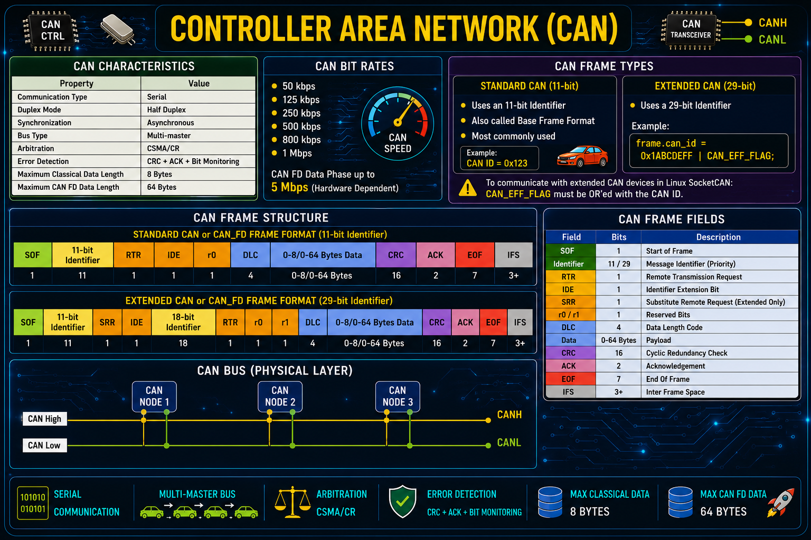

# Controller Area Network (CAN) Protocol

<p align="center">
    
</p>

---

# Table of Contents

- [Overview](#overview)
- [CAN Features](#can-features)
- [CAN Characteristics](#can-characteristics)
- [CAN Bit Rates](#can-bit-rates)
- [CAN Frame Types](#can-frame-types)
  - [Standard CAN (11-bit)](#standard-can-11-bit)
  - [Extended CAN (29-bit)](#extended-can-29-bit)
- [CAN Frame Structure](#can-frame-structure)
  - [Standard CAN Frame Format](#standard-can-frame-format)
  - [Extended CAN Frame Format](#extended-can-frame-format)
- [CAN Frame Fields](#can-frame-fields)
- [CAN Identifier](#can-identifier)
- [SocketCAN in Linux](#socketcan-in-linux)
- [Linux CAN Interface Setup](#linux-can-interface-setup)
- [CAN FD (Flexible Data Rate)](#can-fd-flexible-data-rate)
- [CAN FD Flags](#can-fd-flags)
  - [Frame Configuration Flags](#frame-configuration-flags)
  - [CAN ID Flags](#can-id-flags)
  - [Socket Configuration Flag](#socket-configuration-flag)
- [CAN FD Linux Configuration](#can-fd-linux-configuration)
- [CAN Programming using SocketCAN](#can-programming-using-socketcan)
- [Testing using can-utils](#testing-using-can-utils)
- [Useful Linux Commands](#useful-linux-commands)
- [References](#references)

---

# Overview

**Controller Area Network (CAN)** is a robust, message-oriented communication protocol originally developed by Bosch for automotive applications. It allows multiple Electronic Control Units (ECUs) to communicate over a shared two-wire differential bus without requiring a host computer.

Today, CAN is widely used in:

- Automotive
- Industrial Automation
- Medical Devices
- Robotics
- Embedded Systems
- Aerospace
- Marine Electronics

---

# CAN Features

- Multi-master communication
- Message-based protocol
- High reliability
- Built-in error detection
- Error confinement
- Automatic retransmission
- Differential signaling
- Excellent noise immunity
- Real-time communication
- Priority-based arbitration

---

**Controller Area Network (CAN)**

# CAN Characteristics

| Property | Value |
|-----------|--------|
| Communication Type | Serial |
| Duplex Mode | Half Duplex |
| Synchronization | Asynchronous |
| Bus Type | Multi-master |
| Arbitration | CSMA/CR |
| Error Detection | CRC + ACK + Bit Monitoring |
| Maximum Classical Data Length | 8 Bytes |
| Maximum CAN FD Data Length | 64 Bytes |

---

# CAN Bit Rates

Common CAN bus speeds include:

| Bit Rate |
|-----------|
| 50 kbps |
| 125 kbps |
| 250 kbps |
| 500 kbps |
| 800 kbps |
| 1 Mbps |
| CAN FD Data Phase up to 5 Mbps (Hardware Dependent) |

---

# CAN Frame Types

## Standard CAN (11-bit)

- Uses an **11-bit Identifier**
- Also called **Base Frame Format**
- Most commonly used

Example:

```c
CAN ID = 0x123
```

---

## Extended CAN (29-bit)

Uses a **29-bit Identifier**

Example:

```c
frame.can_id = 0x1ABCDEFF | CAN_EFF_FLAG;
```

**Important**

To communicate with extended CAN devices in Linux SocketCAN:

```c
CAN_EFF_FLAG
```

must be OR'ed with the CAN ID.

---

# CAN Frame Structure

## Standard CAN or CAN_FD Frame Format (11-bit Identifier)

```text
┌─────┬───────────────────┬─────┬─────┬────┬─────┬─────────────────────┬─────┬─────┬─────┬─────┐
│ SOF │ 11-bit Identifier │ RTR │ IDE │ r0 │ DLC │ 0-8/0-64 Bytes Data │ CRC │ ACK │ EOF │ IFS │
└─────┴───────────────────┴─────┴─────┴────┴─────┴─────────────────────┴─────┴─────┴─────┴─────┘
```

---

## Extended CAN or CAN_FD Frame Format (29-bit Identifier)

```text
┌─────┬───────────────────┬─────┬─────┬───────────────────┬─────┬────┬────┬─────┬─────────────────────┬─────┬─────┬─────┬─────┐
│ SOF │ 11-bit Identifier │ SRR │ IDE │ 18-bit Identifier │ RTR │ r0 │ r1 │ DLC │ 0-8/0-64 Bytes Data │ CRC │ ACK │ EOF │ IFS │
└─────┴───────────────────┴─────┴─────┴───────────────────┴─────┴────┴────┴─────┴─────────────────────┴─────┴─────┴─────┴─────┘
```

---

## Standard CAN FD Frame Format (11-bit Identifier)

```text
┌─────┬───────────────────┬─────┬─────┬─────┬─────┬─────┬─────┬─────────────────┬─────┬─────┬─────┬─────┐
│ SOF │ 11-bit Identifier │ RRS │ FDF │ res │ BRS │ ESI │ DLC │ 0-64 Bytes Data │ CRC │ ACK │ EOF │ IFS │
└─────┴───────────────────┴─────┴─────┴─────┴─────┴─────┴─────┴─────────────────┴─────┴─────┴─────┴─────┘
```

---

## Extended CAN FD Frame Format (29-bit Identifier)

```text
┌─────┬───────────────────┬─────┬─────┬───────────────────┬─────┬─────┬─────┬─────┬─────┬─────────────────┬─────┬─────┬─────┬─────┐
│ SOF │ 11-bit Identifier │ SRR │ IDE │ 18-bit Identifier │ RRS │ FDF │ res │ BRS │ DLC │ 0-64 Bytes Data │ CRC │ ACK │ EOF │ IFS │
└─────┴───────────────────┴─────┴─────┴───────────────────┴─────┴─────┴─────┴─────┴─────┴─────────────────┴─────┴─────┴─────┴─────┘
```
---

# CAN Frame Fields

| Field | Bits | Description |
|------|------|-------------|
| SOF | 1 | Start of Frame |
| Identifier | 11 / 29 | Message Identifier (Priority) |
| RTR | 1 | Remote Transmission Request |
| IDE | 1 | Identifier Extension Bit |
| SRR | 1 | Substitute Remote Request (Extended Only) |
| r0/r1 | 1 | Reserved | Reserved Bits |
| DLC | 4 | Data Length Code |
| Data | 0–64 Bytes | Payload |
| CRC | 16 | Cyclic Redundancy Check |
| ACK | 2 | Acknowledgement |
| EOF | 7 | End Of Frame |
| IFS | 3+ | Inter Frame Space |

---

# CAN Identifier

CAN communication is entirely based on **Message Identifiers (CAN IDs)**.

Lower identifier values have higher priority during arbitration.

Examples:

Standard CAN

```text
0x123
```

Extended CAN

```text
0x1ABCDEFF
```

Linux Extended CAN

```c
frame.can_id = 0x1ABCDEFF | CAN_EFF_FLAG;
```

---

# SocketCAN in Linux

Linux provides native CAN support through **SocketCAN**, which integrates CAN devices into the networking subsystem.

SocketCAN supports:

- Classical CAN
- CAN FD
- Virtual CAN (vcan)
- CAN Filters
- Broadcast Manager
- Error Frames

---

# Linux CAN Interface Setup

Load CAN kernel modules

```bash
sudo modprobe can
```

Create CAN interface

```bash
sudo ip link add dev can0 type can
```

Set bitrate

```bash
sudo ip link set can0 type can bitrate 125000
```

Bring interface up

```bash
sudo ip link set can0 up
```

View interface

```bash
ip -details link show can0
```

Statistics

```bash
ip -details -statistics link show can0
```

Restart interface

```bash
ip link set can0 type can restart
```

---

# CAN FD (Flexible Data Rate)

CAN FD extends Classical CAN by increasing payload size and allowing higher data rates.

Advantages

- Payload increased from **8 Bytes** to **64 Bytes**
- Faster transmission
- Reduced bus load
- Backward compatible (hardware dependent)

---

# CAN FD Flags

## Frame Configuration Flags

Used with

```c
struct canfd_frame
```

### CANFD_BRS

Bit Rate Switch

```c
frame.flags = CANFD_BRS;
```

Enables faster bitrate during the data phase.

---

### CANFD_ESI

Error State Indicator

```c
frame.flags = CANFD_ESI;
```

Indicates whether the transmitting node is in an error-passive state.

---

# CAN ID Flags

These flags are packed inside

```c
frame.can_id
```

---

## CAN_EFF_FLAG

Extended Frame Format

```c
frame.can_id = 0x1F000012 | CAN_EFF_FLAG;
```

Required for **29-bit CAN IDs**.

---

## CAN_RTR_FLAG

Remote Transmission Request

```c
frame.can_id |= CAN_RTR_FLAG;
```

**Note**

RTR is **not supported in CAN FD**.

---

## CAN_ERR_FLAG

Indicates an error frame.

```c
frame.can_id |= CAN_ERR_FLAG;
```

Used while receiving hardware or bus error messages.

---

# Socket Configuration Flag

CAN FD sockets require enabling

```c
CAN_RAW_FD_FRAMES
```

Example

```c
int enable_canfd = 1;

setsockopt(socket_fd,
           SOL_CAN_RAW,
           CAN_RAW_FD_FRAMES,
           &enable_canfd,
           sizeof(enable_canfd));
```

Without this option, Linux rejects CAN FD frames.

---

# CAN FD Linux Configuration

Configure CAN FD

```bash
sudo ip link set can0 type can bitrate 500000 dbitrate 2000000 fd on
```

Bring interface up

```bash
sudo ip link set can0 up
```

Example

- Arbitration Bitrate : 500 kbps
- Data Bitrate : 2 Mbps

---

# CAN Programming using SocketCAN

Classical CAN uses

```c
struct can_frame
```

Maximum payload

```
8 Bytes
```

CAN FD uses

```c
struct canfd_frame
```

Maximum payload

```
64 Bytes
```

Mandatory changes for CAN FD

- Use `struct canfd_frame`
- Enable `CAN_RAW_FD_FRAMES`
- Configure CAN FD interface using `fd on`

---

# Testing using can-utils

Transmit Classical CAN

```bash
cansend can0 123#11223344
```

Transmit CAN FD

```bash
cansend can0 123##1.AABBCCDD
```

Monitor bus

```bash
candump can0
```

---

# Useful Linux Commands

Load CAN driver

```bash
sudo modprobe can
```

Create CAN interface

```bash
sudo ip link add dev can0 type can
```

Set bitrate

```bash
sudo ip link set can0 type can bitrate 500000
```

Enable CAN FD

```bash
sudo ip link set can0 type can bitrate 500000 dbitrate 2000000 fd on
```

Bring interface UP

```bash
sudo ip link set can0 up
```

Bring interface DOWN

```bash
sudo ip link set can0 down
```

Show interface

```bash
ip -details link show can0
```

Show statistics

```bash
ip -details -statistics link show can0
```

Restart CAN

```bash
ip link set can0 type can restart
```

---

# References

## Linux Kernel Documentation

https://docs.kernel.org/networking/can.html

https://www.kernel.org/doc/Documentation/networking/can.txt

---

## eLinux CAN Documentation

https://elinux.org/CAN_Bus

---

# License

This document is intended for educational purposes and embedded Linux development using **SocketCAN** and **CAN FD**.
