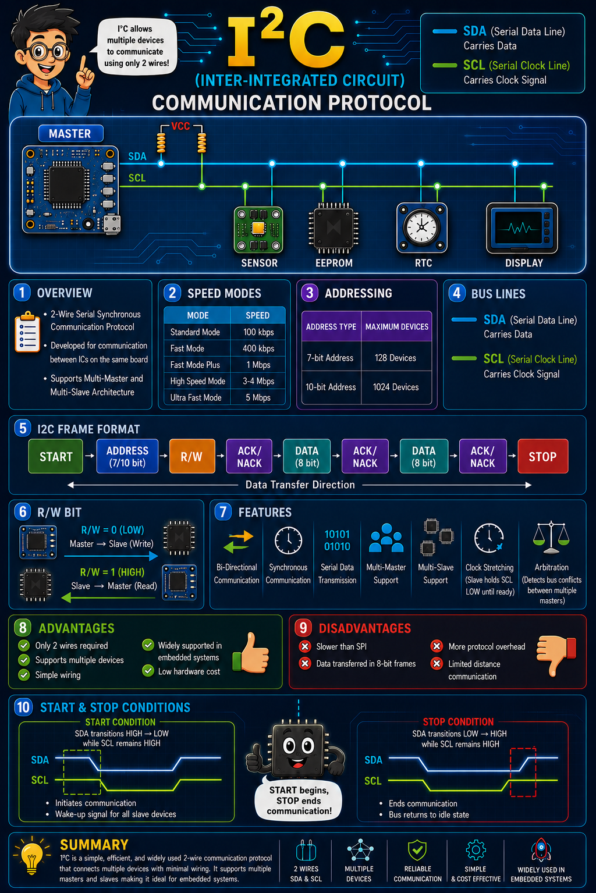

# I2C Communication (Inter-Integrated Circuit)

<p align="center">
    
</p>

---

# Table of Contents

- [Overview](#overview)
- [I2C Characteristics](#i2c-characteristics)
- [I2C Bus Lines](#i2c-bus-lines)
  - [SDA – Serial Data Line](#sda--serial-data-line)
  - [SCL – Serial Clock Line](#scl--serial-clock-line)
- [I2C Communication Speeds](#i2c-communication-speeds)
- [Supported Topologies](#supported-topologies)
  - [Single Master Single Slave](#single-master-single-slave)
  - [Single Master Multiple Slaves](#single-master-multiple-slaves)
  - [Multi-Master Multi-Slave](#multi-master-multi-slave)
- [Addressing Scheme](#addressing-scheme)
  - [7-bit Addressing](#7-bit-addressing)
  - [10-bit Addressing](#10-bit-addressing)
- [I2C Frame Format](#i2c-frame-format)
- [Frame Components](#frame-components)
  - [START](#start)
  - [Slave Address](#slave-address)
  - [R/W Bit](#rw-bit)
  - [ACK/NACK Bit](#acknack-bit)
    - [ACK](#ack)
    - [NACK](#nack)
  - [DATA Field](#data-field)
  - [STOP](#stop)
- [Start Condition](#start-condition)
  - [State](#state)
  - [Action](#action)
  - [Timing Representation](#timing-representation)
- [Stop Condition](#stop-condition)
  - [State](#state-1)
  - [Action](#action-1)
  - [Timing Representation](#timing-representation-1)
- [Repeated Start Condition](#repeated-start-condition)
  - [Purpose](#purpose)
  - [State](#state-2)
  - [Sequence](#sequence)
- [Typical Example](#typical-example)
- [Features](#features)
- [Clock Stretching](#clock-stretching)
  - [How Clock Stretching Works](#how-clock-stretching-works)
  - [Timing Representation](#timing-representation-2)
  - [Applications](#applications)
- [Arbitration](#arbitration)
  - [Arbitration Principle](#arbitration-principle)
  - [Arbitration Example](#arbitration-example)
  - [Arbitration Timing](#arbitration-timing)
- [Advantages](#advantages)
  - [Simple Interface](#simple-interface)
  - [Supports Multiple Devices](#supports-multiple-devices)
  - [Address-Based Communication](#address-based-communication)
  - [Widely Supported](#widely-supported)
  - [Low Cost](#low-cost)
- [Disadvantages](#disadvantages)
  - [Lower Throughput](#lower-throughput)
  - [Limited Data Size](#limited-data-size)
  - [Pull-up Resistors Required](#pull-up-resistors-required)
  - [Bus Capacitance Limitations](#bus-capacitance-limitations)
  - [More Protocol Overhead](#more-protocol-overhead)
- [Project Directory Structure](#project-directory-structure)
- [Building on Generic Linux System](#building-on-generic-linux-system)
  - [Method 1 : Direct Compilation](#method-1--direct-compilation)
  - [Method 2 : Using Makefile](#method-2--using-makefile)
- [Running Application](#running-application)
- [Linux I2C Utilities](#linux-i2c-utilities)
  - [Detect Available Devices](#detect-available-devices)
  - [Reading AHT20 Data](#reading-aht20-data)
  - [Checking Available Buses](#checking-available-buses)
- [Electrical Characteristics](#electrical-characteristics)
- [Pull-up Resistors](#pull-up-resistors)
  - [Typical Pull-up Values](#typical-pull-up-values)
  - [Pull-up Selection Considerations](#pull-up-selection-considerations)
- [Bus Capacitance](#bus-capacitance)
  - [Maximum Recommended Bus Capacitance](#maximum-recommended-bus-capacitance)
  - [Sources of Capacitance](#sources-of-capacitance)
- [Rise Time](#rise-time)
  - [Rise Time Equation](#rise-time-equation)
  - [Example Calculation](#example-calculation)
  - [Maximum Rise Time Limits](#maximum-rise-time-limits)
- [Fall Time](#fall-time)
- [PCB Layout Recommendations](#pcb-layout-recommendations)
- [Practical Recommendations](#practical-recommendations)
- [Design Tips](#design-tips)
- [Yocto Integration](#yocto-integration)
- [Yocto Dependencies](#yocto-dependencies)
  - [Required Packages](#required-packages)
  - [What Does i2c-tools Provide?](#what-does-i2c-tools-provide)
- [Kernel Configuration](#kernel-configuration)
  - [Generic Kernel Configuration](#generic-kernel-configuration)
  - [Menuconfig](#menuconfig)
- [Platform Specific Drivers](#platform-specific-drivers)
  - [NXP i.MX](#nxp-imx)
  - [Marvell CN9130](#marvell-cn9130)
  - [Raspberry Pi](#raspberry-pi)
  - [STM32](#stm32)
- [Device Tree Requirements](#device-tree-requirements)
  - [Adding AHT20](#adding-aht20)
- [Recipe Integration](#recipe-integration)
  - [Directory Layout](#directory-layout)
- [i2c.bb Recipe](#i2cbb-recipe)
- [Generic Makefile Support](#generic-makefile-support)
  - [Install](#install)
- [Add Application to Image](#add-application-to-image)
- [Add Layer](#add-layer)
- [Building](#building)
- [Deploying](#deploying)
- [Verifying Application](#verifying-application)
  - [Prerequisites](#prerequisites)
- [Troubleshooting](#troubleshooting)
  - [No I2C Device Found](#no-i2c-device-found)
  - [Permission Issues](#permission-issues)
  - [Busy Bus](#busy-bus)
  - [Build Failures](#build-failures)
- [References](#references)
- [Author](#author)
- [License](#license)
- [Happy Learning !!](#happy-learning-)

---

# Overview

**I2C (Inter-Integrated Circuit)** is a **2-wire, serial, synchronous communication protocol** widely used for communication between integrated circuits, sensors, EEPROMs, RTCs, displays, and other peripheral devices.

The protocol was originally developed by NXP (formerly Philips) and has become one of the most commonly used serial communication standards in embedded systems.

I2C provides a simple mechanism to connect multiple devices using only two signal lines, significantly reducing PCB routing complexity and pin count.

---

# I2C Characteristics

| Property                | Description    |
| ----------------------- | -------------- |
| Communication Type      | Serial         |
| Synchronization         | Synchronous    |
| Number of Wires         | 2              |
| Topology                | Shared Bus     |
| Communication Direction | Bi-Directional |
| Multi-Master Support    | Yes            |
| Multi-Slave Support     | Yes            |

---

# I2C Bus Lines

I2C communication uses only two signals.

## SDA – Serial Data Line

The SDA line is used to transfer data between the Master and Slave devices.

Characteristics:

* Bi-directional
* Open-drain/Open-collector
* Requires pull-up resistor
* Shared among all devices on the bus

---

## SCL – Serial Clock Line

The SCL line provides synchronization for data transmission.

Characteristics:

* Generated by Master
* Shared among all devices
* Open-drain
* Supports Clock Stretching

---

# I2C Communication Speeds

I2C supports multiple speed modes.

| Mode            | Speed    |
| --------------- | -------- |
| Standard Mode   | 100 kbps |
| Fast Mode       | 400 kbps |
| Fast Mode Plus  | 1 Mbps   |
| High Speed Mode | 3.4 Mbps |
| Ultra Fast Mode | 5 Mbps   |

---

# Supported Topologies

## Single Master Single Slave

```text
Master
  │
  │
Slave
```

---

## Single Master Multiple Slaves

```text
                Slave1
                   │
Master ─────────────┼──── Slave2
                   │
                Slave3
```

---

## Multi-Master Multi-Slave

```text
Master1 ─────┐
             │
             ├──────── Shared I2C Bus ───── Slave1
             │
Master2 ─────┘                         ├──── Slave2
                                       └──── Slave3
```

---

# Addressing Scheme

The number of available slave devices depends on the address width.

| Address Width  | Number of Addresses |
| -------------- | ------------------- |
| 7-bit Address  | 128                 |
| 10-bit Address | 1024                |

---

## 7-bit Addressing

Most commonly used.

Address Range

```text
0x00 to 0x7F
```

Total addresses

```text
128
```

---

## 10-bit Addressing

Used in systems requiring a larger number of slave devices.

Address Range

```text
0x000 to 0x3FF
```

Total addresses

```text
1024
```

---

# I2C Frame Format

A typical I2C transaction consists of the following sequence:

```text
┌───────┬─────────────┬─────┬──────────┬─────────┬──────────┬─────────┬──────────┬──────┐
│ START │ 7/10 Address│ R/W │ ACK/NACK │  DATA   │ ACK/NACK │  DATA   │ ACK/NACK │ STOP │
└───────┴─────────────┴─────┴──────────┴─────────┴──────────┴─────────┴──────────┴──────┘
```

---

# Frame Components

## START

Generated by the Master to initiate communication.

Purpose:

* Wake-up all slave devices
* Gain ownership of the bus
* Begin a transaction

---

## Slave Address

Identifies the destination device.

Supported formats:

* 7-bit
* 10-bit

Example

```text
0x38
```

AHT20 Sensor Address

```text
00111000
```

---

## R/W Bit

Determines transfer direction.

| Bit Value | Description                |
| --------- | -------------------------- |
| 0         | Master sends data to Slave |
| 1         | Slave sends data to Master |

Examples

Write transaction

```text
Address + 0
```

Read transaction

```text
Address + 1
```

---

## ACK/NACK Bit

After receiving every byte, the receiver generates an acknowledgment.

### ACK

Bit Value

```text
0
```

Meaning

Receiver accepted data.

### NACK

Bit Value

```text
1
```

Meaning

Receiver rejected data.

Possible reasons

* Slave absent
* Invalid address
* Device busy
* Read completed
* Communication failure

---

## DATA Field

Data is transferred in blocks of

```text
8 bits
```

Examples

```text
0xAC
```

```text
0x33
```

```text
0x00
```

---

## STOP

Generated by Master.

Terminates communication.

Releases bus ownership.

Bus returns to Idle State.

---

# Start Condition

A START condition acts as a wake-up call to all connected slave devices on the bus.

---

## State

Master pulls

```text
SDA : HIGH → LOW
SCL : HIGH
```

---

## Action

This is one of the only times in the I2C protocol where the SDA line is allowed to change state while the SCL line remains HIGH.

All slaves monitor the bus continuously and detect this transition.

---

## Timing Representation

```text
SCL  ────────────────

SDA  ────────┐
             │
             └────────
```

---

# Stop Condition

A STOP condition designates the end of communication.

---

## State

Master releases

```text
SDA : LOW → HIGH
SCL : HIGH
```

---

## Action

Both SDA and SCL return to HIGH.

Bus enters Idle State.

Devices wait for another transaction.

---

## Timing Representation

```text
SCL  ────────────────

SDA  _________
              │
              └────────
```

---

# Repeated Start Condition

Sometimes a Master wants to start another transaction without releasing the bus.

This commonly happens when switching from a Write operation to a Read operation.

---

## Purpose

Avoid losing bus ownership.

Useful in:

* Multi-master systems
* Sensor register reads
* EEPROM access
* Combined transactions

---

## State

The Master sends another START before issuing STOP.

---

## Sequence

```text
START
   │
Address + Write
   │
Register Address
   │
Repeated START
   │
Address + Read
   │
Read Data
   │
STOP
```

---

# Typical Example

Reading AHT20 sensor data

```text
START

0x38 + Write

ACK

0xAC

ACK

0x33

ACK

0x00

ACK


Repeated START


0x38 + Read


ACK


Read 7 Bytes


NACK


STOP
```

---

# Features

The I2C protocol provides several important capabilities.

* Bi-Directional Communication

* Serial Transmission

* Synchronous Communication

* Low Pin Count

* Multi-Master Support

* Multi-Slave Support

* Clock Stretching

* Arbitration

---

# Clock Stretching

Clock Stretching is a mechanism that allows a slave device to temporarily pause communication when it is not ready to accept or transmit additional data.

This feature ensures reliable communication with slower peripherals.

## How Clock Stretching Works

Normally, the Master controls the SCL line and determines the communication speed.

However, a Slave device may require additional processing time.

In such situations:

1. The Master attempts to release the SCL line.
2. The Slave keeps the SCL line LOW.
3. Communication is paused.
4. The Slave releases SCL when it becomes ready.
5. The Master resumes data transfer.

## Timing Representation

```text
Master SCL : ──────┐      ┌─────────────
                   │      │
Slave SCL  :       └──────┘

Bus SCL    : ──────┐______┌─────────────
                   Stretch
```

## Applications

Clock Stretching is commonly used by:

* Temperature Sensors
* Humidity Sensors
* EEPROM Devices
* ADC Converters
* RTC Devices

Example devices:

* AHT20
* BMP280
* DS3231
* AT24Cxx EEPROM

---

# Arbitration

I2C supports multiple Masters sharing the same communication bus.

Only one Master can actively communicate at a given time.

Arbitration ensures collision-free communication.


## Arbitration Principle

Each Master continuously monitors the SDA line while transmitting data.

If a Master intends to transmit a HIGH level but detects a LOW level, it assumes another Master is driving the bus.

The Master immediately stops transmission.

The winning Master continues communication.


## Arbitration Example

Master 1 transmits

```text
1
```

Master 2 transmits

```text
0
```

Observed on bus

```text
0
```

Master 1 loses arbitration.

Master 2 wins arbitration.


## Arbitration Timing

```text
Master1 SDA : ────────1────────

Master2 SDA : ────────0────────

Bus SDA     : ────────0────────


Master1 : Stops transmission

Master2 : Continues communication
```

---

# Features

I2C provides numerous advantages for embedded applications.


## Bi-Directional Communication

Both Master and Slave devices can exchange data.

Communication direction is selected using the R/W bit.


## Synchronous Communication

Data transfer is synchronized using the SCL clock.

This eliminates timing drift issues commonly found in asynchronous interfaces.


## Serial Transmission

Data is transmitted one bit at a time.

Advantages include:

* Reduced pin count
* Simplified routing
* Lower EMI


## Multi-Master Support

Multiple controllers can coexist on the same bus.

Example:

```text
MCU1
   │
   ├────────── SDA
MCU2
```


## Multi-Slave Support

Several devices can share the same communication bus.

Example:

```text
Master
   │
   ├── RTC
   ├── EEPROM
   ├── OLED
   └── AHT20
```


## Low Hardware Requirement

Only two wires are required.

Advantages:

* Lower PCB complexity
* Reduced connector size
* Fewer processor pins

---

# Advantages


## Simple Interface

Only SDA and SCL signals are required.


## Supports Multiple Devices

Several peripherals can be connected simultaneously.


## Address-Based Communication

Each slave has a unique address.

No dedicated Chip Select signals are required.


## Widely Supported

Most embedded sensors support I2C.

Examples:

* AHT20
* BME280
* MPU6050
* DS3231
* SSD1306


## Low Cost

Reduces wiring requirements.

Suitable for compact embedded designs.

---

# Disadvantages


## Lower Throughput

I2C is slower compared to SPI.

Comparison:

| Protocol | Maximum Speed    |
| -------- | ---------------- |
| UART     | ~1 Mbps          |
| I2C      | 5 Mbps           |
| SPI      | Tens of Mbps     |
| QSPI     | Hundreds of Mbps |


## Limited Data Size

Data is transmitted in 8-bit frames.

Large data transfers require multiple transactions.


## Pull-up Resistors Required

SDA and SCL are open-drain signals.

Typical resistor values:

```text
2.2kΩ
4.7kΩ
10kΩ
```


## Bus Capacitance Limitations

Long traces increase capacitance.

This limits achievable communication speed.


## More Protocol Overhead

Compared to SPI, I2C introduces:

* START
* STOP
* ACK
* Addressing
* Arbitration

---

# Project Directory Structure

Directory layout:

```text
~/Linux_Protocol_Applications/I2C

.

├── di2cAHT20.c
├── di2cAHT20.h
├── di2c.c
├── di2c.h
├── README.md
└── I2C_Communication.png


1 directory, 5 files
```

---

# Building on Generic Linux System


## Method 1 : Direct Compilation

Compile the application using GCC.

```bash
gcc -Wall -Wextra -O2 \
di2c.c \
di2cAHT20.c \
-o di2c
```


## Method 2 : Using Makefile

Compile

```bash
make
```

Clean

```bash
make clean
```

---

# Running Application

Execute

```bash
sudo ./di2c
```

---

# Linux I2C Utilities

The Linux kernel provides useful tools for I2C debugging.

Package:

```bash
i2c-tools
```


## Detect Available Devices

The Linux **i2c-tools** package provides built-in utilities that can be used to validate I2C communication.
Scan the I2C bus to identify the slave address assigned to the sensor.

Command

```bash
i2cdetect -y 1
```

Example Output

```text
     0  1  2  3  4  5  6  7  8  9  a  b  c  d  e  f
00:                         -- -- -- -- -- -- -- -- 
10: -- -- -- -- -- -- -- -- -- -- -- -- -- -- -- -- 
20: -- -- -- -- -- -- -- -- -- -- -- -- -- -- -- -- 
30: -- -- -- -- -- -- -- -- 38 -- -- -- -- -- -- -- 
40: -- -- -- -- -- -- -- -- -- -- -- -- -- -- -- -- 
50: -- -- -- -- -- -- -- -- -- -- -- -- -- -- -- -- 
60: -- -- -- -- -- -- -- -- -- -- -- -- -- -- -- -- 
70: -- -- -- -- -- -- -- --     
```

Detected device:

```text
0x38
```

AHT20 Sensor Address.


## Reading AHT20 Data

The AHT20 sensor requires a measurement command to be issued before the sensor data can be read. The following command sequence performs the complete transaction:

* Sends the measurement trigger command.
* Waits 100 ms for the measurement to complete.
* Reads the 7-byte response from the sensor.

```bash
i2ctransfer -y 1 \
w3@0x38 0xAC 0x33 0x00 && \
sleep 0.1 && \
i2ctransfer -y 1 r7@0x38
```

Example Output

```text
0x18 0x80 0x3A 0x1D 0x7B 0x2A 0x00
```

The above command should be executed as a **single command sequence** to ensure that the measurement is triggered, completed, and read successfully.


## Checking Available Buses

```bash
ls /dev/i2c*
```

Example

```text
/dev/i2c-0
/dev/i2c-1
/dev/i2c-2
```

---

# Electrical Characteristics

I2C uses **open-drain/open-collector outputs**, which require external pull-up resistors on both the SDA and SCL lines.

The electrical characteristics of the bus directly affect communication reliability, signal integrity, and achievable bus speeds.

---

# Pull-up Resistors

Since I2C devices can only actively drive the bus LOW, pull-up resistors are required to return the lines to a HIGH state.

Both lines require independent pull-up resistors.

```text
        VCC
         │
       4.7kΩ
         │
SDA ─────┼──────────── Slave1
         │
         ├──────────── Slave2
         │
         └──────────── Master


        VCC
         │
       4.7kΩ
         │
SCL ─────┼──────────── Slave1
         │
         ├──────────── Slave2
         │
         └──────────── Master
```


## Typical Pull-up Values

| Bus Speed | Typical Pull-up      |
| --------- | -------------------- |
| 100 kbps  | 4.7 kΩ               |
| 400 kbps  | 2.2 kΩ               |
| 1 Mbps    | 1 kΩ – 2.2 kΩ        |
| 3.4 Mbps  | 470 Ω – 1 kΩ         |
| 5 Mbps    | Application Specific |


## Pull-up Selection Considerations

The pull-up resistor value depends on:

* Supply voltage
* Bus capacitance
* Number of connected devices
* Required rise time
* Desired communication speed

Smaller resistor values provide:

Advantages:

* Faster rise times
* Higher communication speeds

Disadvantages:

* Increased current consumption

Larger resistor values provide:

Advantages:

* Reduced power consumption

Disadvantages:

* Slower signal transitions

---

# Bus Capacitance

Each device connected to the bus contributes parasitic capacitance.

Examples include:

* PCB traces
* Device input capacitance
* Connectors
* Cable assemblies


## Maximum Recommended Bus Capacitance

According to the I2C specification:

```text
400 pF
```

is the maximum recommended total bus capacitance for Standard and Fast Mode communication.


## Sources of Capacitance

Typical values:

| Source       | Capacitance |
| ------------ | ----------- |
| MCU Pin      | 5–10 pF     |
| Sensor       | 5–15 pF     |
| Connector    | 2–5 pF      |
| PCB Trace    | 1–3 pF/cm   |
| Ribbon Cable | 50–100 pF/m |

---

# Rise Time

Rise time is the duration required for the signal voltage to transition from LOW to HIGH.

Slow rise times can lead to communication errors.


## Rise Time Equation

Approximation:

```text
Tr ≈ 0.8473 × Rp × Cbus
```

Where

```text
Tr      = Rise Time

Rp      = Pull-up Resistance

Cbus    = Total Bus Capacitance
```


## Example Calculation

Assume:

```text
Rp = 4.7 kΩ

Cbus = 200 pF
```

Result:

```text
Tr ≈ 0.8473 × 4700 × 200×10⁻¹²


Tr ≈ 0.8 µs
```


## Maximum Rise Time Limits

| Mode     | Maximum Rise Time |
| -------- | ----------------- |
| 100 kbps | 1000 ns           |
| 400 kbps | 300 ns            |
| 1 Mbps   | 120 ns            |
| 3.4 Mbps | 80 ns             |

---

# Fall Time

Fall time is primarily determined by the output transistor characteristics of the devices connected to the bus.

Unlike rise time, pull-up resistors have minimal influence on the falling edge.

---

# PCB Layout Recommendations

To improve signal quality:

Recommended:

* Keep SDA and SCL traces short.
* Place pull-up resistors close to the Master.
* Minimize stubs.
* Avoid routing near noisy switching supplies.
* Use a solid ground plane.

Avoid:

* Long ribbon cables.
* Excessive fan-out.
* Very weak pull-up resistors.
* Large capacitive loads.

---

# Practical Recommendations

| Speed                 | Recommended Pull-up |
| --------------------- | ------------------- |
| 100 kbps              | 4.7 kΩ              |
| 400 kbps              | 2.2 kΩ              |
| 1 Mbps                | 1.8 kΩ              |
| 3.4 Mbps              | 680 Ω               |
| Short PCB Traces      | 4.7 kΩ              |
| Long Cable Assemblies | 1 kΩ – 2.2 kΩ       |

---

# Design Tips

For most embedded designs operating at **100 kbps or 400 kbps**, **4.7 kΩ pull-up resistors** with a bus capacitance below **200 pF** provide reliable communication.

For high-speed applications, engineers should validate rise times using an oscilloscope to ensure compliance with the I2C specification.

---

# Yocto Integration

This section describes how to integrate the I2C application into a Yocto build system.

The steps are generic and work for most Yocto releases including:

* Dunfell
* Gatesgarth
* Hardknott
* Kirkstone
* Langdale
* Mickledore
* Scarthgap

---

# Yocto Dependencies

The Linux userspace application depends on the Linux I2C subsystem and userspace utilities.


## Required Packages

Add the following package to your image.

```conf
IMAGE_INSTALL:append = " i2c-tools"
```

Alternatively,

```conf
CORE_IMAGE_EXTRA_INSTALL += "i2c-tools"
```


## What Does i2c-tools Provide?

It installs utilities such as

```text
i2cdetect
i2cget
i2cset
i2cdump
i2ctransfer
```

Useful for:

* Bus scanning
* Debugging
* Sensor validation
* Register access
* Manufacturing tests

---

# Kernel Configuration

Ensure Linux kernel support for I2C is enabled.


## Generic Kernel Configuration

```config
CONFIG_I2C=y
CONFIG_I2C_CHARDEV=y
```


## Menuconfig

Navigate to

```text
Device Drivers
    └── I2C support
            <*> I2C support
            <*> I2C device interface
```

---

# Platform Specific Drivers

Depending on the processor used.

Examples


### NXP i.MX

```config
CONFIG_I2C_IMX=y
```


### Marvell CN9130

```config
CONFIG_I2C_MV64XXX=y
```


### Raspberry Pi

```config
CONFIG_I2C_BCM2835=y
```


### STM32

```config
CONFIG_I2C_STM32=y
```

---

# Device Tree Requirements

The I2C controller must be enabled.

Example

```dts
&i2c1 {

        status = "okay";

};
```


## Adding AHT20

Example

```dts
&i2c1 {

        status = "okay";

        aht20@38 {

                compatible = "aosong,aht20";

                reg = <0x38>;

        };

};
```

---

# Recipe Integration

Create a custom layer.

Example

```text
meta-custom/
└── recipes-apps/
    └── i2c/
```


## Directory Layout

```text
meta-custom/

└── recipes-apps/

    └── i2c/

        ├── i2c.bb

        ├── di2c.c

        ├── di2c.h

        ├── di2cAHT20.c

        └── di2cAHT20.h
```

---

# i2c.bb Recipe

```bitbake

SUMMARY = "I2C Communication Application"

DESCRIPTION = "Generic Linux I2C userspace application"

LICENSE = "MIT"

LIC_FILES_CHKSUM = "file://${COMMON_LICENSE_DIR}/MIT;md5=0835ade698e0bcf8506ecda2f7b4f302"


SRC_URI = " \
        file://di2c.c \
        file://di2c.h \
        file://di2cAHT20.c \
        file://di2cAHT20.h \
"


S = "${WORKDIR}"


do_compile()
{

        ${CC} ${CFLAGS} \
                di2c.c \
                di2cAHT20.c \
                -o di2c

}


do_install()
{

        install -d ${D}${bindir}

        install -m 0755 \
                di2c \
                ${D}${bindir}

}
```

---

# Generic Makefile Support

If using Makefile.

Recipe

```bitbake

SRC_URI += "file://Makefile"

do_compile()
{

        oe_runmake

}
```


## Install

```bitbake

do_install()
{

        install -d ${D}${bindir}

        install -m 0755 \
                di2c \
                ${D}${bindir}

}
```

---

# Add Application to Image

Append package.

```conf
IMAGE_INSTALL:append = " di2c"
```

---

# Add Layer

```bash
bitbake-layers add-layer ../meta-custom
```

Verify

```bash
bitbake-layers show-layers
```

---

# Building

Initialize environment.

```bash
source oe-init-build-env
```

Build recipe.

```bash
bitbake di2c
```

Build image.

Example

```bash
bitbake core-image-minimal
```

or

```bash
bitbake core-image-base
```

---

# Deploying

Flash image.

Boot target.

Login.

Check executable.

```bash
which di2c
```

Expected

```text
/usr/bin/di2c
```

---

# Verifying Application

Run

```bash
di2c
```

---

## Prerequisites

Ensure that the **i2c-tools** package is installed on the target.

```bash
which i2cdetect
which i2ctransfer
```

Expected Output

```text
/usr/sbin/i2cdetect
/usr/sbin/i2ctransfer
```

These utilities are provided by the `i2c-tools` package and are commonly used for debugging and validating I2C peripherals in Linux systems.


---

# Troubleshooting

---

## No I2C Device Found

Check

```bash
ls /dev/i2c*
```

Verify

Kernel driver.

Device Tree.

Sensor power.

Pull-up resistors.

Bus frequency.

---

## Permission Issues

Run

```bash
sudo i2cdetect -y 1
```

---

## Busy Bus

Check

```bash
i2cdetect -y 1
```

Verify

Clock Stretching.

Arbitration.

Another process using bus.

---

## Build Failures

Verify

Layer added.

Recipe syntax.

Source files.

BitBake logs.

Useful logs.

```bash
tmp/work/*/*/temp/log.do_compile
```

---

# References

* NXP I2C Specification
* Linux Kernel I2C Documentation
* AHT20 Datasheet
* Yocto Project Documentation
* Embedded Linux Development Best Practices

---

## Author

**Dhawal Umesh Lad**

Embedded Linux Developer

Expertise:

* UART
* SPI
* I2C
* CAN
* Yocto
* OpenWRT
* Device Drivers
* BSP Development
* Embedded Systems

---

# License

This project is distributed under the MIT License.

Refer to the LICENSE file for details.

---

## Happy Learning !!

```
I2C makes embedded communication simple,
efficient and scalable.
```

