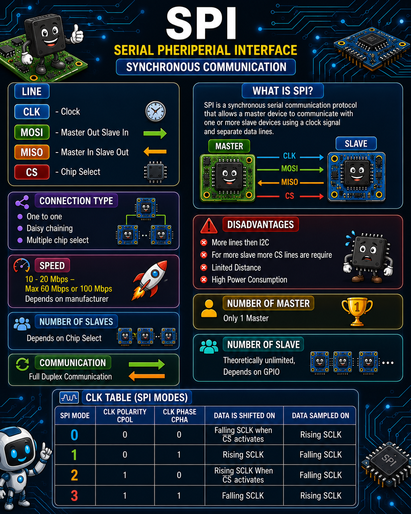
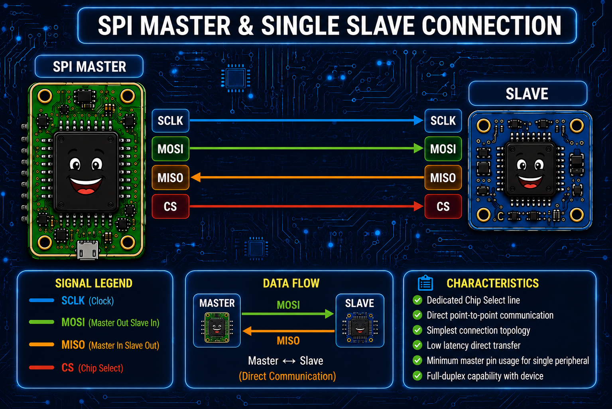
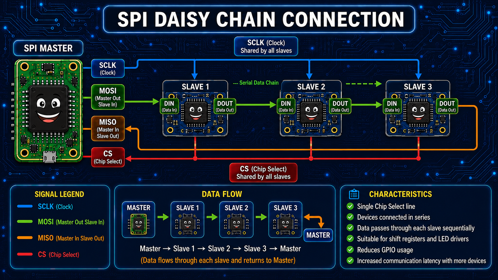
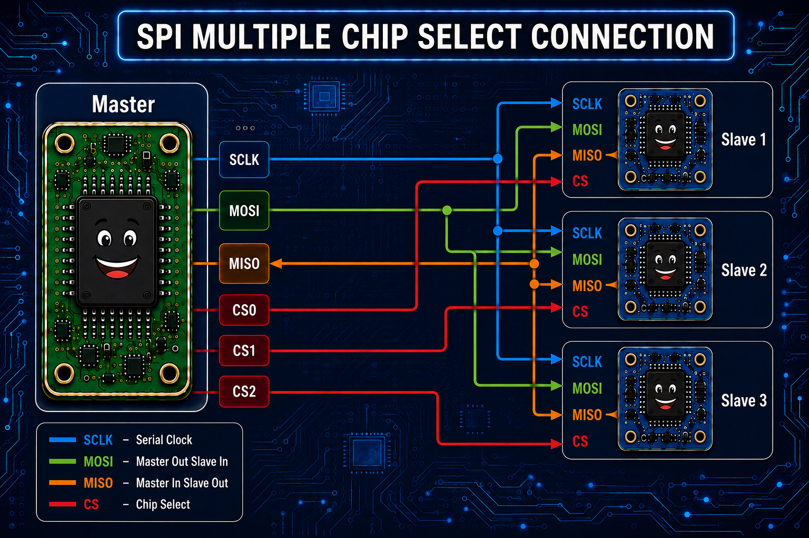

# SPI (Serial Peripheral Interface)

The following diagram illustrates the basic SPI communication between a Master and a Slave device.

<p align="center">
  
</p>

---

# SPI Connection Types

SPI supports multiple hardware connection topologies.

## 1. One-to-One Connection

One master communicates with a single slave using dedicated SPI signals and a single Chip Select.

<p align="center">
  
</p>

---

## 2. Daisy Chain Connection

In a daisy-chain configuration, multiple SPI devices are connected in series, allowing a single Chip Select line to control all devices.

<p align="center">
  
</p>

---

## 3. Multiple Chip Select Connection

A single master communicates with multiple slave devices using independent Chip Select (CS) lines while sharing the clock and data lines.

<p align="center">
  
</p>

---

# Overview

**SPI (Serial Peripheral Interface)** is a synchronous serial communication protocol widely used for high-speed communication between a **master** device and one or more **slave** devices. It is commonly used to interface peripherals such as Flash memory, EEPROMs, ADCs, DACs, sensors, displays, and communication modules.

Unlike I²C, SPI is a **full-duplex** protocol, allowing simultaneous transmission and reception of data.

---

# Features

- Synchronous communication protocol
- Full-duplex communication
- Master-Slave architecture
- High-speed data transfer
- Simple hardware implementation
- No addressing overhead
- Suitable for short-distance communication

---

# SPI Signal Lines

SPI typically uses four signal lines:

| Signal | Description |
|---------|-------------|
| **SCLK / CLK** | Serial Clock generated by the Master |
| **MOSI** | Master Out Slave In (Master → Slave) |
| **MISO** | Master In Slave Out (Slave → Master) |
| **CS / SS** | Chip Select (Active Low) |

---

# Connection Types

SPI supports multiple hardware configurations.

## 1. One-to-One Connection

One master communicates with one slave using a dedicated Chip Select.

```
Master
 │
 ├── CLK
 ├── MOSI
 ├── MISO
 └── CS
        │
      Slave
```

---

## 2. Multiple Chip Select

One master communicates with multiple slaves using separate Chip Select lines.

```
             Master
          ┌───────────┐
CLK  ----------------------------+
MOSI ----------------------------+
MISO <---------------------------+
CS0 ----------------------> Slave 1
CS1 ----------------------> Slave 2
CS2 ----------------------> Slave 3
```

Only one slave is active at a time.

---

## 3. Daisy Chain

Multiple SPI devices are connected in series.

```
Master
   │
 MOSI
   │
Slave1 → Slave2 → Slave3
   │
 MISO
```

Only one Chip Select line is required.

---

# Communication Characteristics

| Parameter | Description |
|-----------|-------------|
| Communication Type | Synchronous |
| Duplex Mode | Full Duplex |
| Clock Source | Master |
| Data Direction | Bidirectional |
| Addressing | Not Required |
| Error Detection | Not Built-in |

---

# Speed

SPI supports significantly higher speeds than I²C.

Typical speed ranges:

- **10 Mbps – 20 Mbps**
- Maximum:
  - **60 Mbps**
  - **100 Mbps**
- Actual maximum speed depends on:
  - Manufacturer
  - Controller capability
  - PCB layout
  - Slave device specifications

---

# Number of Masters

- Only **one Master** is supported on a single SPI bus.

---

# Number of Slaves

Theoretically **unlimited**.

Practically limited by:

- Available GPIO pins
- Number of Chip Select (CS) lines
- Electrical loading of the bus

---

# Advantages

- Very high communication speed
- Full-duplex communication
- Simple protocol
- Low software overhead
- No device addressing
- Suitable for high-speed peripherals

---

# Disadvantages

- Requires more signal lines than I²C
- Each additional slave generally requires an additional Chip Select line
- Limited communication distance
- Higher power consumption
- Supports only one master

---

# SPI Clock Modes

SPI communication supports **4 clock modes**, determined by:

- **CPOL (Clock Polarity)**
- **CPHA (Clock Phase)**

| SPI Mode | CPOL | CPHA | Data Shifted On | Data Sampled On |
|----------|------|------|-----------------|-----------------|
| **Mode 0** | 0 | 0 | Falling edge after CS becomes active | Rising edge |
| **Mode 1** | 0 | 1 | Rising edge | Falling edge |
| **Mode 2** | 1 | 0 | Rising edge after CS becomes active | Falling edge |
| **Mode 3** | 1 | 1 | Falling edge | Rising edge |

---

# SPI Mode Summary

| Mode | Clock Idle State | Sampling Edge |
|------|------------------|---------------|
| Mode 0 | Low | Rising |
| Mode 1 | Low | Falling |
| Mode 2 | High | Falling |
| Mode 3 | High | Rising |

---

# Applications

SPI is commonly used with:

- NOR/NAND Flash Memory
- EEPROM
- SD Cards
- TFT/LCD Displays
- Touch Controllers
- ADC/DAC Devices
- Temperature Sensors
- Pressure Sensors
- IMU Sensors
- Ethernet Controllers
- Wi-Fi Modules
- Bluetooth Modules

---

# Comparison: SPI vs I²C

| Feature | SPI | I²C |
|---------|-----|-----|
| Communication | Synchronous | Synchronous |
| Duplex | Full Duplex | Half Duplex |
| Signal Lines | 4+ | 2 |
| Speed | Very High | Moderate |
| Device Addressing | No | Yes |
| Multiple Masters | No | Yes |
| Multiple Slaves | Yes (using CS) | Yes (using addresses) |
| Hardware Complexity | Higher | Lower |
| Communication Distance | Short | Moderate |

---

# Summary

SPI is a high-speed synchronous communication protocol designed for short-distance communication between one master and one or more slave devices. It provides full-duplex communication with minimal protocol overhead, making it ideal for high-performance peripherals. While it requires more wiring than I²C due to dedicated Chip Select lines, it offers significantly higher throughput and simpler communication.
